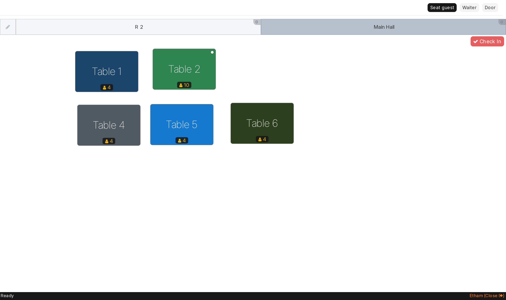
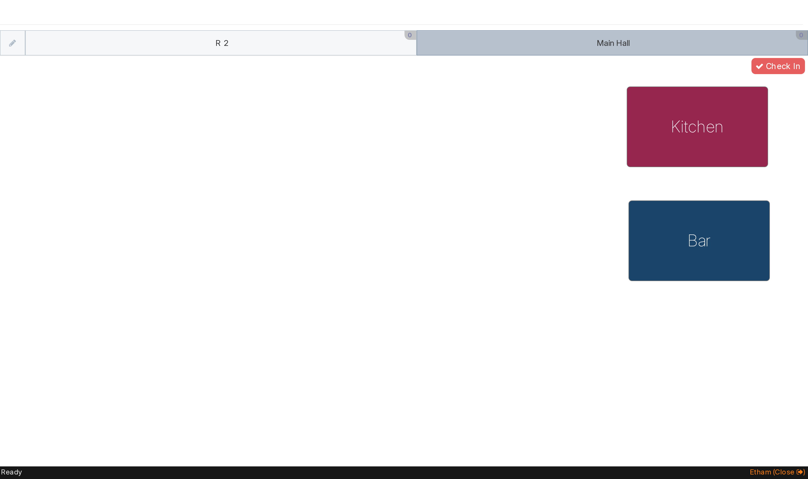
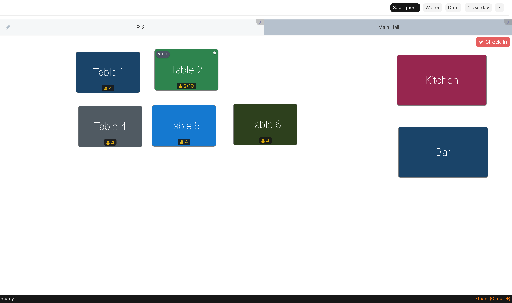

# What this achieves

One POS, three different screens. Each device signs in once and shows only what
that job needs:

| Station | Sees | Cannot see or do |
|---|---|---|
| **Waiter tablet** | tables and seats, seat a guest, take orders, send to kitchen | Kitchen/Bar boards, the money button, opening or closing the day, releasing a table |
| **Kitchen / Bar screen** | its own board of incoming tickets | tables, seating, money, the day |
| **Cashier till** | everything — tables, boards, and the money | editing the menu |
| **Admin (you)** | everything | — |

This is enforced by the server, not by hiding buttons. A waiter who reaches the
payment call anyway is refused, and the attempt is recorded against their
session. Hiding the controls simply keeps the screen honest and uncluttered.

---

# The two identity layers

**Devices log in. People don't.**

1. **Each device signs into the site once** with its station account and stays
   signed in — a waiter tablet as `waiter@`, the kitchen screen as `kitchen@`,
   the till as `cashier@`.
2. **Waiters identify by PIN** on the shared tablet: floor → **Waiter** → name →
   4-digit PIN, once per shift. That PIN is what stamps their name on parties,
   orders and the sales report.

Kitchen and cashier need no PIN — the station login is the identity.

---

# 1. Set up a waiter tablet (or desktop)

1. Open `frappe.ikobriq.com/login` on the device.
2. Sign in as **`waiter@etham.co.ke`**. Tick *Remember me* so it stays signed in.
3. Go to **`frappe.ikobriq.com/app/restaurant-manage`**.
4. Bookmark that page, or "Add to Home screen" on a tablet so it opens like an app.
5. Confirm the screen shows: tables only, and just three buttons —
   **Seat guest · Waiter · Door**. No Kitchen or Bar tiles, no day buttons.

Every waiter taps their PIN when they **seat** and when they **Order**; a PIN stays
good for 90 seconds (admin-adjustable), so a tablet passed hand to hand always
records the right person.

---

# 2. Set up a kitchen or bar screen

1. Sign the screen in as **`kitchen@etham.co.ke`**.
2. Go to **`/app/restaurant-manage`** and bookmark it.
3. The floor shows **only Kitchen and Bar** — no tables, no toolbar buttons.
4. Tap **Kitchen** (or **Bar**) to open that board full-screen. Leave it there.

Tickets appear as waiters fire orders. Tapping an item walks it
Sent → Preparing → Ready → Served. Use one screen per station: the kitchen
screen on Kitchen, the bar screen on Bar.

---

# 3. Set up the cashier till

1. Sign in as **`cashier@etham.co.ke`**.
2. Go to **`/app/restaurant-manage`** and bookmark it.
3. The till sees everything: all tables **and** the Kitchen/Bar boards, plus the
   day button (**Open day** / **Close day**) and **Release a table** under the
   **⋯** menu.

The cashier's daily rhythm: **Open day** with the counted float before service →
settle checks through the day → **Close day** at the end.

---

# 3b. Silent receipt printing on the till

Paying a check prints the receipt from the till's own tab: the print dialog
opens at once, already pointed at the default printer. To skip the dialog
entirely (paper comes out the moment the cashier confirms):

1. Set the Posiflex as the **default printer** in Windows, paper size 80 mm.
2. Start Chrome for the till with the flag `--kiosk-printing` — right-click
   the Chrome shortcut → Properties → add ` --kiosk-printing` at the end of
   *Target*. Use that shortcut for the till.
3. Print one receipt to confirm the dialog no longer appears.

Without the flag the dialog still appears instantly and one tap on **Print**
sends it — no second tab either way.

---

# 4. Add another device or change a password

**Another tablet of the same kind:** just sign in with the same station account.
Any number of devices can share one station login.

**A new kind of station:** search `User` → *Add*, then under **Roles** copy the
roles from the station account that matches the job. The roles that matter:

| Role | Grants |
|---|---|
| `Restaurant User` | see and work the floor — seat, order, send to kitchen |
| `Waiter Station` | hide the Kitchen/Bar boards |
| `Kitchen Station` | hide the tables and the front-of-house buttons |
| `Accounts User` | take payments |
| `Sales Manager` | open and close the day, release tables |
| `Restaurant Manager` | **edit the floor plan** — add, rename and delete tables |

Give a waiter tablet `Restaurant User` + `Waiter Station`. Give a kitchen screen
`Restaurant User` + `Kitchen Station`. Give a till those two payment roles plus
`Restaurant Manager`, and no station role.

> Do **not** give a waiter tablet or kitchen screen `Restaurant Manager`: that
> is the role that lets a screen add and delete tables.

**Passwords:** avatar (bottom-left) → *My Settings* → *Reset Password*. Change
all three station passwords on first use.

---

# 5. Confirming it worked

On each device, check the toolbar — it is the quickest tell:

| Station | Toolbar should read |
|---|---|
| Waiter | `Seat guest` · `Waiter` · `Door` |
| Kitchen | *(no buttons — just the two boards)* |
| Cashier | `Seat guest` · `Waiter` · `Door` · `Open day`/`Close day` · `⋯` |

And on a waiter tablet, open a table with a party on it: the pad shows the menu
and the check, but **no Complete button** — payment is the till's job.

---

# 6. Proof from the live system

These are real screenshots of `frappe.ikobriq.com`, one per station, taken with
a party of two seated on Table 2.

**Waiter tablet** — five tables, `SH·2` badge and `2/10` seats on Table 2, and
only three buttons. No Kitchen, no Bar, no money.

**Kitchen screen** — Kitchen and Bar only. No tables, no buttons at all.

**Cashier till** — the same five tables *plus* Kitchen and Bar, the table to be
billed showing `2/10`, and `Close day` on the toolbar with `Release a table`
under `⋯`.

---

# 7. If a screen looks wrong

| Symptom | Fix |
|---|---|
| Waiter tablet shows Kitchen/Bar tiles | The account is missing the `Waiter Station` role — add it (section 4). |
| A station shows an empty floor — no rooms at all | It is missing `Restaurant User`, or the site has rows under **Restaurant Permissions** that do not list this user. Clear those rows (unused by design) or add the user to them. |
| Kitchen screen shows tables | Missing the `Kitchen Station` role. |
| Cashier has no day button | Missing `Sales Manager`. |
| "Wrong PIN" | The stored PIN differs from what was typed. Open `Restaurant Waiter`, tap the **eye icon** on the PIN field to see it before saving. |
| Buttons hidden under a `⋯` menu | Normal on a narrow window — widen it, or use the menu. |
| Blank floor after an update | Reload the page once; the browser is holding an old copy. |
